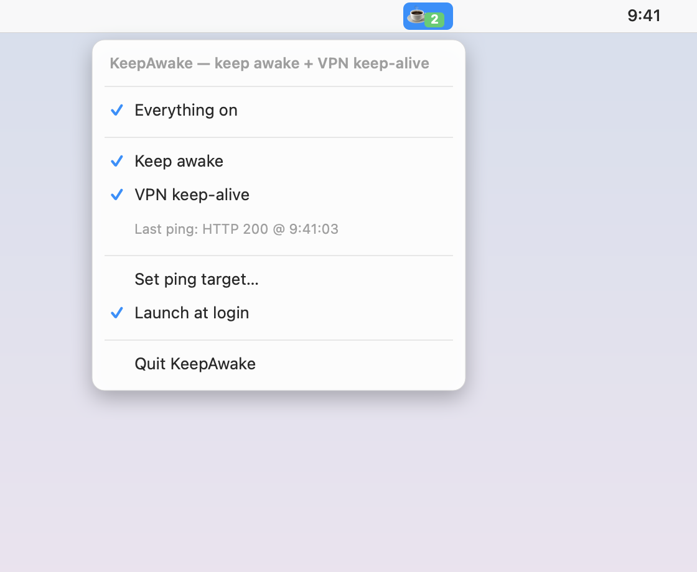

# KeepAwake

[](https://github.com/ngnnah/keepawake/actions/workflows/build.yml)

A tiny macOS **menu-bar app** that keeps your Mac awake and keeps a VPN/Wi-Fi
connection from idling out while you're away.

It does two things while active:

1. **Prevents sleep** — runs `caffeinate -dimu` (blocks display, idle, and disk
   sleep; the `-i` flag works on battery too).
2. **VPN keep-alive** — pings a host you choose (default `https://example.com`)
   every 60s to defeat VPN/portal idle timeouts.

The menu-bar icon shows state (`☕` active / empty cup idle), and everything is
toggleable from its dropdown. It can launch itself at login via a launchd
LaunchAgent.



## Install a prebuilt release (no build)

Grab `KeepAwake.zip` from the [Releases](https://github.com/ngnnah/keepawake/releases)
page, then:

```bash
unzip KeepAwake.zip -d /Applications/
xattr -dr com.apple.quarantine /Applications/KeepAwake.app   # clear the download flag
open -a KeepAwake
```

Releases are built automatically by CI when a `v*` tag is pushed.

## Build & install

```bash
./build.sh
```

or `make build`. Requires the Xcode **Command Line Tools** (`swiftc`,
`iconutil`) — no runtime dependencies. The script compiles a single-file Swift
app into `KeepAwake.app`, generates an icon, ad-hoc signs it, and copies it to
`/Applications`. Then launch it from `/Applications` (first launch of an
unsigned app: right-click → **Open**).

### Make targets

| Target | Does |
|--------|------|
| `make build` | Compile + install to `/Applications` |
| `make uninstall` | Quit, remove the app, LaunchAgent, and stray `caffeinate` |
| `make screenshot` | Regenerate `docs/screenshot.png` from `mockup.swift` |
| `make clean` | Remove `build/` |

## Menu

| Item | What it does |
|------|--------------|
| **Keep awake** | Toggle sleep prevention (`caffeinate`) |
| **VPN keep-alive** | Toggle the periodic ping |
| **Last ping** | Shows the most recent ping result/time |
| **Set ping target…** | Set the URL/host and interval (seconds) |
| **Launch at login** | Install/remove the launchd LaunchAgent |
| **Quit** | Stop everything and exit |

Settings persist across launches (`UserDefaults`). "Launch at login" writes
`~/Library/LaunchAgents/com.nhat.keepawake.plist`.

## How "launch at login" works

The LaunchAgent points at the app binary with `RunAtLoad` in the Aqua session.
It loads on the **next login** (we don't bootstrap it immediately, so we never
spawn a duplicate alongside a running instance; the app also has a
single-instance guard).

## Caveats

- **Closing a MacBook lid still sleeps** (clamshell sleep) regardless of
  `caffeinate` — keep the lid open.
- **Split-tunnel VPN:** if only internal ranges route through the VPN, pinging a
  public host (like `example.com`) won't keep the *tunnel* alive — point it at an
  internal host instead. Full-tunnel VPNs are fine with any target.
- **Security:** leaving a Mac awake and connected on unattended **public Wi-Fi**
  carries real exposure (physical access, network snooping). Weigh that before
  leaving it running in public.

## Uninstall

```bash
make uninstall
```

Or manually:

```bash
rm -rf /Applications/KeepAwake.app
rm -f ~/Library/LaunchAgents/com.nhat.keepawake.plist
launchctl bootout gui/$(id -u)/com.nhat.keepawake 2>/dev/null || true
pkill -f "/usr/bin/caffeinate -dimu" 2>/dev/null || true
```

## License

MIT — see [LICENSE](LICENSE).
